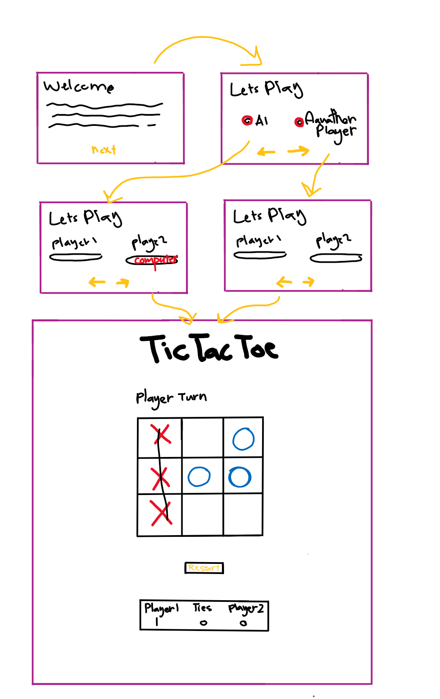

# Tic Tac Toe Game 

## Rules for Tic-Tac-Toe
- The game is played on a grid that's 3 squares by 3 squares.
- You are X, your friend (or the computer in this case) is O. Players take turns putting their marks in empty squares.
- The first player to get 3 of her marks in a row (up, down, across, or diagonally) is the winner.
 - When all 9 squares are full, the game is over. If no player has 3 marks in a row, the game ends in a tie.

## Technologies Used 
- **Browser** : Google Chrome
- **HTML , CSS** 
- **Programing language** : JavaScript 
- **Libraries** : jQuery

## Wireframe 

## Development Process
First Stage | Second Stage | Third Stage | Final Sage 
------------ | ------------- |------------ | -------------
Set web page files and link them together: Html , CSS , JavaScript.   Create structure of web page: header , body ,footer, divs , button. Set IDs and classes| Strat coding JavaScript(set variables , function ) | Start coding CSS( set background , positions , font color .. etc. ) | improvement
## Tec Tac Toe game Link
https://pages.git.generalassemb.ly/mnaal/project-1/ 

